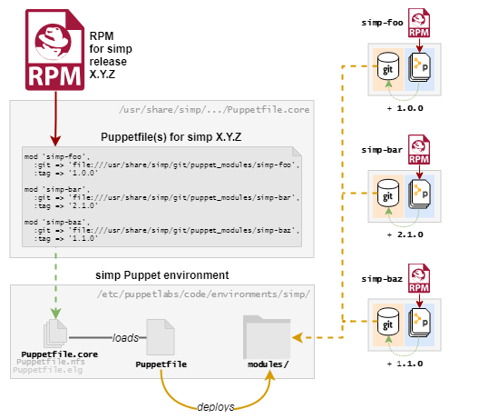

# simp-6188-puppetfile-structure

<!-- vim-markdown-toc GFM -->

* [Overview](#overview)
* [Notes](#notes)
  * [Directory structure](#directory-structure)
  * [References](#references)

<!-- vim-markdown-toc -->

## Overview

This repo contains a proof-of-concept Puppetfile for [SIMP-6197][simp-6197],
[SIMP-6188][simp-6188], and the decision log ["SIMP 6.4.0: What r10k-friendly
RPM features should it include?"][decision-log].



The `Puppetfile` structure validates with:

     r10k puppetfile check

And installs with:

     r10k puppfile install

## Notes

* In contrast to the [decision log proposal][decision-log], this repository
  uses SIMP's _public_ repo URLs to demonstrate its functionality instead of
  local git repositories.
* If we separate  SIMP's subsystems into different Puppetfiles, the
  `simp-rpm-helper` script (or whatever generates the Puppetfiles) will need
  some way to know what Puppetfile each module belongs to when it is generated.
* The only reasons that the local site has its own `Puppetfiles/site/` directory to keep its Puppetfile in


### Directory structure

```
./
│
├── Puppetfile    # top-level file, includes other Puppetfiles (maintained by site admin)
└── Puppetfiles/  # contains Puppetfiles
    ├── site/     # site Puppetfiles (maintained by site admin)
    └── simp/     # simp's vendored Puppetfiles.
        │         #  After installling new RPM modules, the new reference Puppetfiles
        │         #  can be copied into this directory
        ├── Puppetfile.core           # core simp modules
        ├── Puppetfile.extras.nfs     # simp modules for NFS
        ├── Puppetfile.extras.gitlab  # simp modules for Gitlab
        └── ...
```

### References

* https://simp-project.atlassian.net/browse/SIMP-6197 (Parent issue)
* https://simp-project.atlassian.net/browse/SIMP-6188 (This repository)
* https://simp-project.atlassian.net/wiki/spaces/SD/pages/720961629/ (decision log)

[decision-log]: https://simp-project.atlassian.net/wiki/spaces/SD/pages/720961629/
[simp-6197]: https://simp-project.atlassian.net/browse/SIMP-6197
[simp-6188]: https://simp-project.atlassian.net/browse/SIMP-6188

